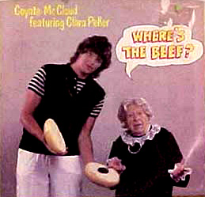

!SLIDE
# (Where)s the beef? #

-><-

!SLIDE bullets incremental transition=fade
# Arel and the Gang #

* Arel - Relational Algebra Library
* ActiveRecord - ORM Layer of Rails
* MetaWhere - ActiveRecord Query Syntax on Steroids
* MetaSearch - Super Sweet Search wrapper for ActiveRecord

!SLIDE bullets incremental transition=fade
# Arel #

* Relational Algebra Library
* ORM Framework
* Produces SQL Queries
* Originally by nkallen now sprinkled with Tenderlove

!SLIDE bullets incremental transition=fade
# ActiveRecord #

* The Object Relational Mapper you know and love/hate
* Refactored in Rails 3.x using ActiveModel and Arel
* Written and maintained by the Rails Team

!SLIDE bullets incremental transition=fade
# MetaWhere #

* Brings predication to AR Where (aka Conditions) Hashes
* Hates SQL in code (don't we all?)
* Makes Where hashes clean and consise
* Written by Ernie (no help from Bert)

!SLIDE bullets incremental transition=fade
# MetaSearch #

* Even more syntactic magic with "search" method for Models
* Form Helpers for using the search functions
* All about Wheres (more later)
* More Ernie code

